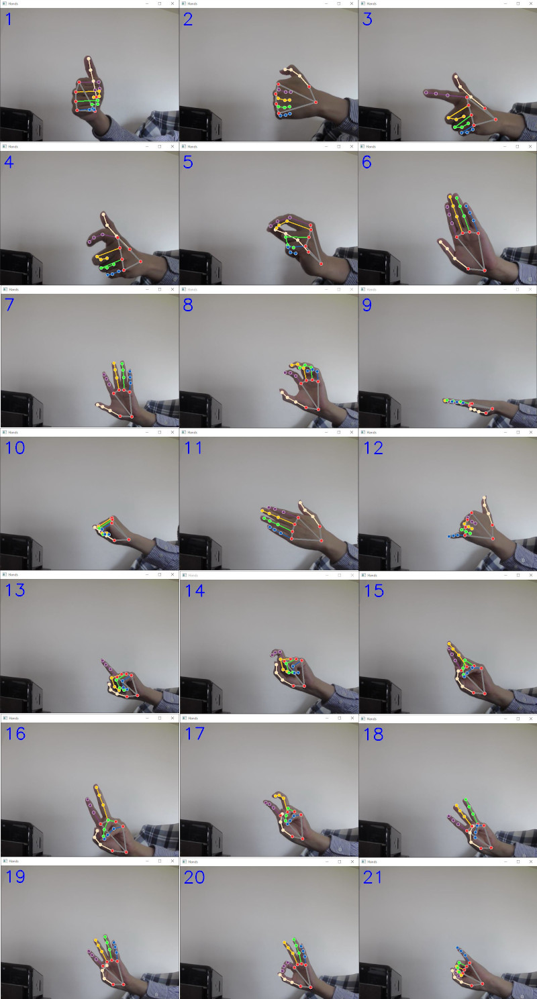

# 手姿勢認識
手の姿勢を認識する AIモデル、Google の MediaPipe を基本ライブラリとして使う。
<br>
### 技術スタック
Python、pyTorch、mediapipe、yolov5
<br>
### 手の姿勢IDと意味合い、数字の意味の一覧
| id  | mark                  | mean                               | number |
| --- | --------------------- | ---------------------------------- | ------ |
| 1   | finger_1              | 親指                               | 10     |
| 2   | finger_1_bending      | 親指、曲げる                       |
| 3   | finger_12_separate    | 銃                                 | 8      |
| 4   | finger_12_bending     | 銃、曲げる                         |
| 5   | finger_123_conect     | 親指、人差し指、中指をつなぐ       | 7      |
| 6   | finger_12345_close    | 指を閉じた                         |
| 7   | finger_12345_separate | 指が離れる                         | 5      |
| 8   | finger_12345_bending  | 指を曲げる                         |
| 9   | finger_12345_flat     | フラット                           |
| 10  | finger_12345_gather   | 拳                                 |
| 11  | finger_12345_back     | 手の甲                             |
| 12  | finger_15_separate    | 親指と小指が離れる                 | 6      |
| 13  | finger_2              | 人差し指                           | 1      |
| 14  | finger_2_bending      | 人差し指が曲がる                   | 9      |
| 15  | finger_23_close       | 人差し指と中指を閉じる             |
| 16  | finger_23_separate    | 人差し指と中指が離れる             | 2      |
| 17  | finger_23_bending     | 人差し指、曲がる                   |
| 18  | finger_234_separate   | 人差し指、中指、薬指が離れる       | 3      |
| 19  | finger_2345_separate  | 人差し指、中指、薬指、小指が離れる | 4      |
| 20  | finger_345_separate   | OK                                 | 3      |
| 21  | finger_5              | 小指                               |

<br>

### ビデオで手の姿勢を認識
手の姿勢が認識されたら、ビデオ画面に数字（姿勢ID）が表示される。




<br>

### 使い方

デフォルトカメラで手の姿勢を認識、--draw_landmarks を指定した場合、手のランドマークを標識
```
python detect/test.py --draw_landmarks
```

--target を指定した場合、ビデオファイルを認識対象とする。
```
python detect/test.py --draw_landmarks --target "your_path/test_020220215_171325.mp4"
```

<br>

### トレーニング

tensorboard フォルダを指定、トレーン状態をモニターする。
```
tensorboard --logdir your_path\detect_hand\
```

pyTorch のpre-trained weights resnet18モデルを用いて 50 epochsでトレーニングを行う

（他のパラメータ、モデルの指定などソースで確認してください）
```
python detect/train.py --n_epochs 50 --pretrained
```
